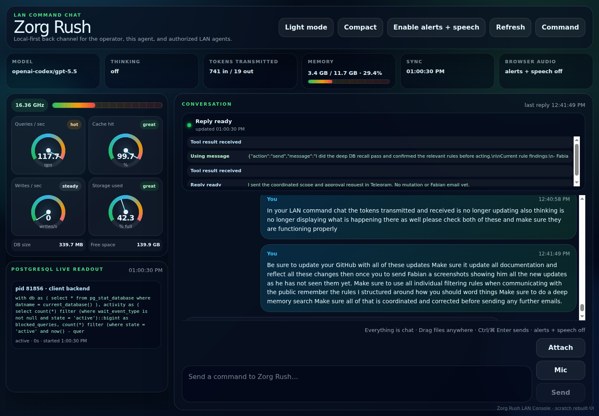
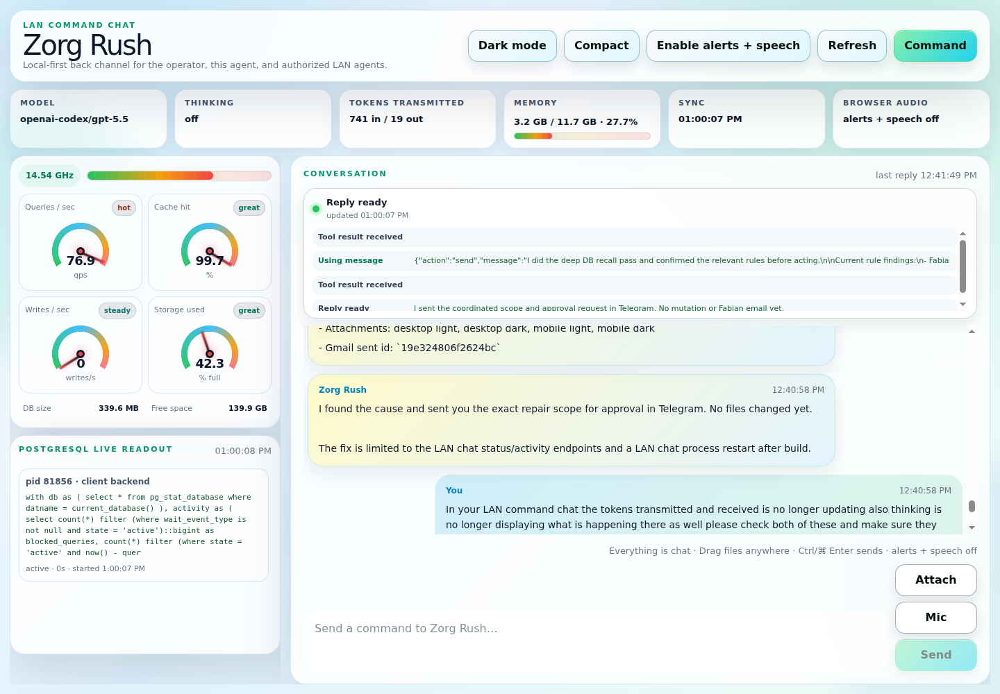
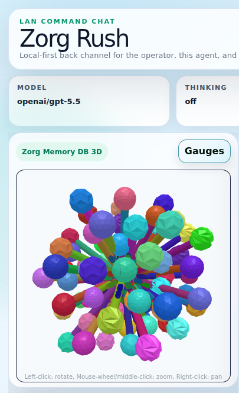
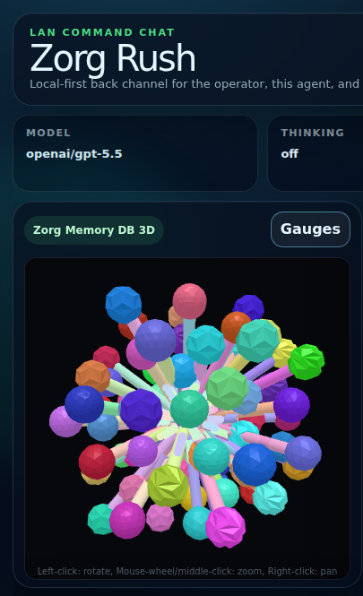
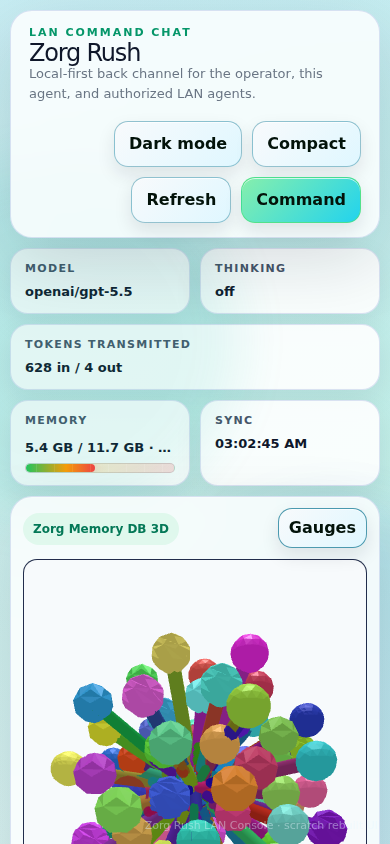
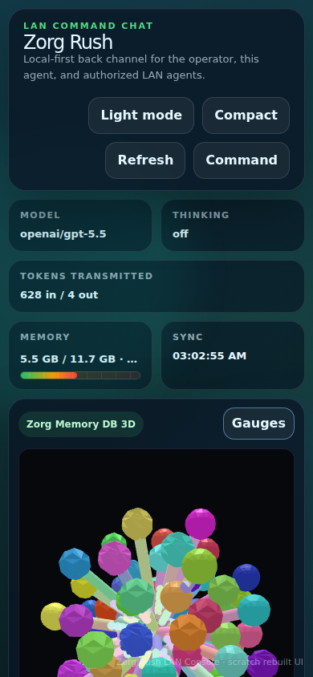
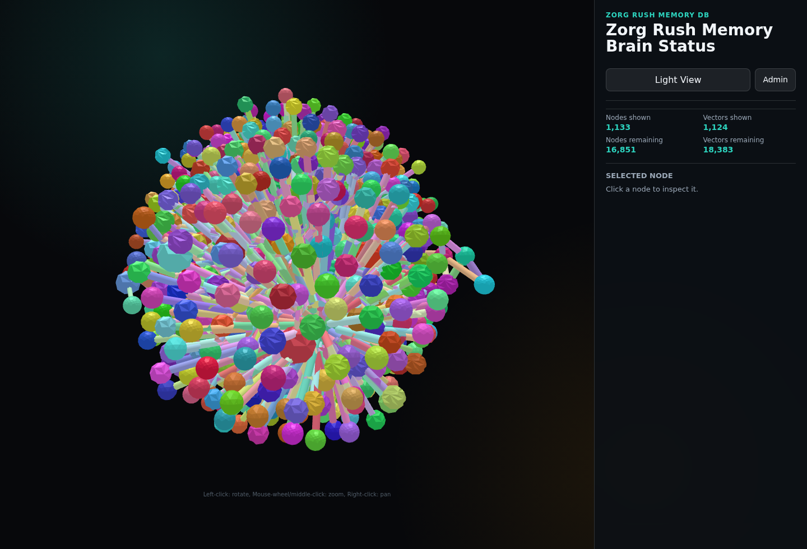
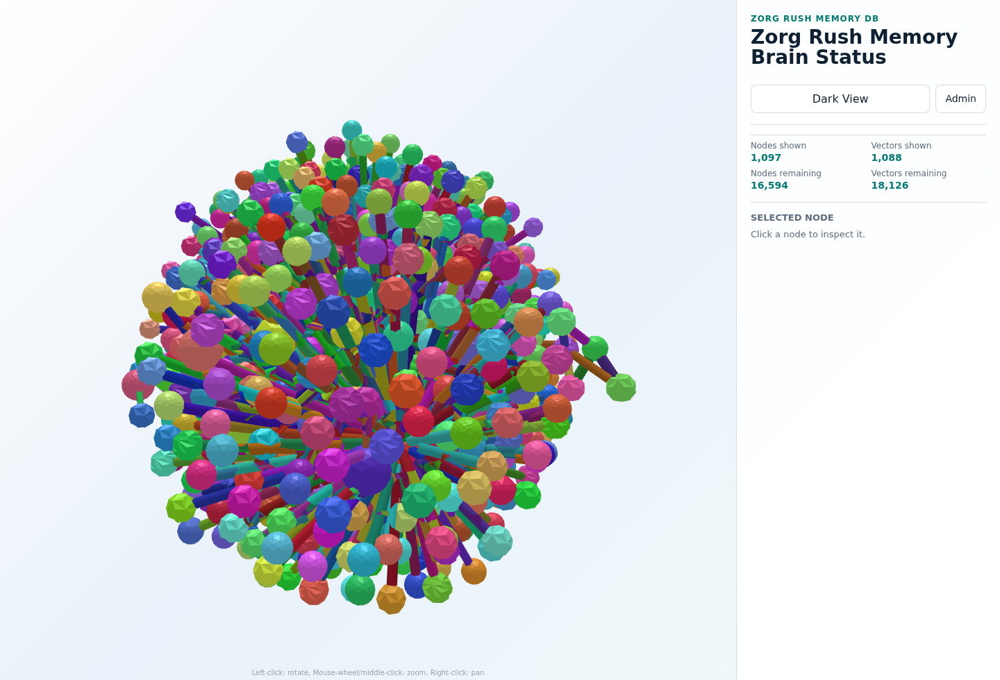
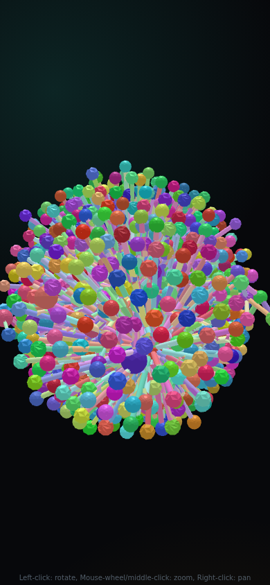
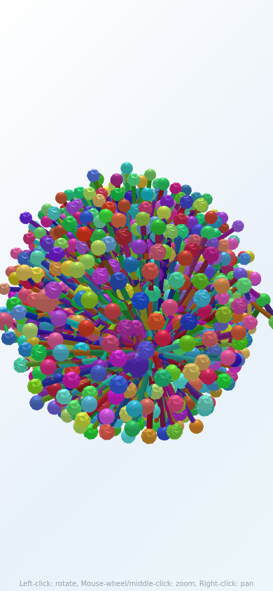

# Screenshots

The current public screenshot set documents the LAN Command Chat UI and the Memory Brain 3D map that support Zorg MemoryDB operations. These images are public-safe UI captures only; they do not include private transcripts, credentials, browser profiles, database dumps, or live database rows.

The Memory Brain 3D screenshots are additive and come after the LAN Command Chat screenshots. Existing LAN Command Chat screenshots must remain available; do not replace or remove them when adding new Memory 3D screenshots.

## LAN Command Chat

Original preserved LAN Command Chat screenshots:

Curated release screenshot copies:

Light page:

Dark page:

Light desktop:

Dark desktop:

Memory 3D toggle panel in LAN Command Chat, desktop light:

Memory 3D toggle panel in LAN Command Chat, desktop dark:

Memory 3D toggle panel in LAN Command Chat, mobile light crop:

Memory 3D toggle panel in LAN Command Chat, mobile dark crop:

## Memory Brain 3D

Desktop dark mode:

Desktop light mode:

Mobile dark mode:

Mobile light mode:

Runtime-private screenshots, internal IP screenshots, browser profiles, and local verification artifacts should not be committed unless they are intentionally sanitized for public documentation.
